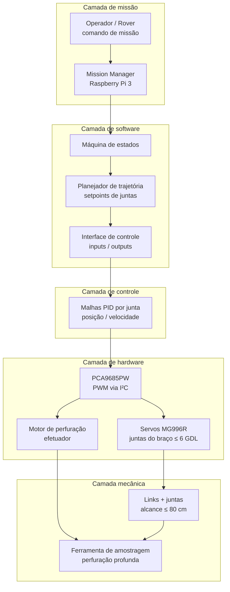
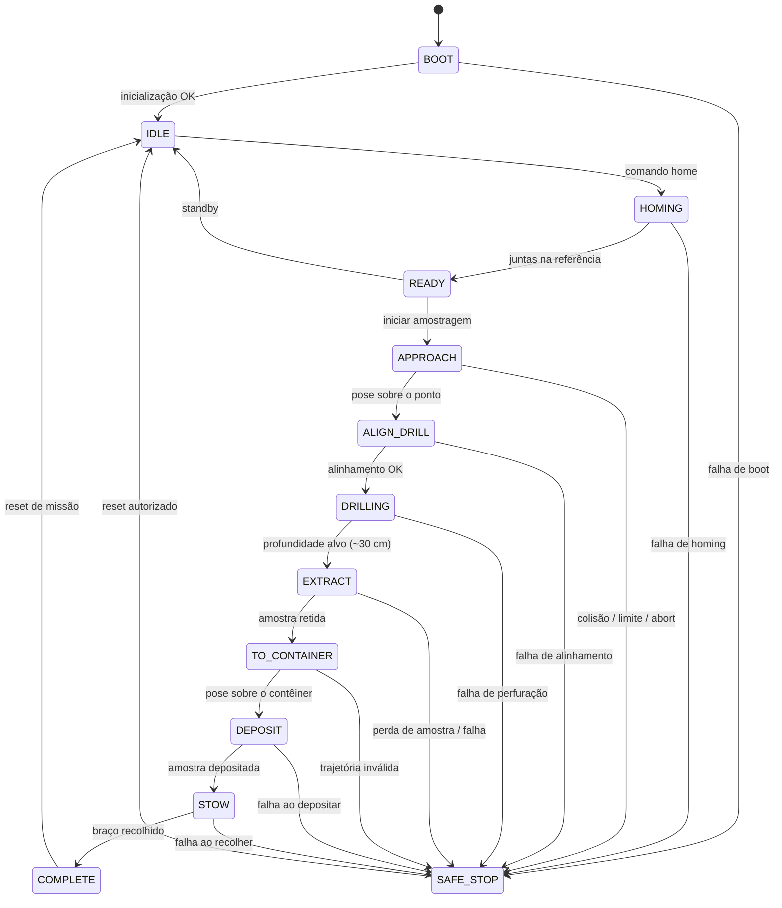
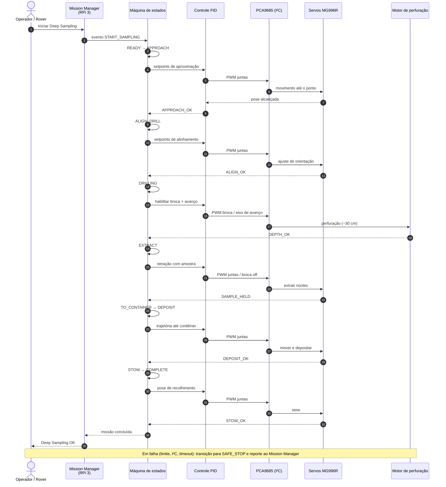

# Diagramas

Diagramas de software do projeto conceitual do manipulador (braço robótico) para a subtarefa de **amostragem profunda (Deep Sampling)** da ERC, conforme o alinhamento inicial e o edital do Projeto Trainee Rover Titans.

## Contexto operacional

O manipulador é projetado para:

- Coletar amostra de até **30 cm** de profundidade
- Depositar a amostra no contêiner embarcado do rover
- Operar com **até 6 GDL**, servos **MG996R** e motor de perfuração dedicado
- Ser controlado por **Raspberry Pi 3** + driver **PCA9685PW (I²C)**

## Diagramas

| Diagrama | Objetivo | Revisão | Status |
| -------- | -------- | ------- | ------ |
| [Arquitetura](#diagrama-de-arquitetura) | Camadas, módulos e interfaces de hardware/software | R01 | Modelado |
| [Máquina de estados](#diagrama-de-maquina-de-estados) | Modos de operação e transições seguras | R01 | Modelado |
| [Sequência](#diagrama-de-sequencia) | Fluxo da amostragem profunda | R01 | Modelado |

---

## Diagrama de arquitetura

Visão em camadas do sistema embarcado. A supervisão de missão e a máquina de estados residem na Raspberry Pi 3; o PCA9685 gera PWM para as juntas; o motor de perfuração é acionado por canal dedicado.

### Interfaces principais

| Origem | Destino | Interface | Conteúdo |
| ------ | ------- | --------- | -------- |
| Mission Manager | Máquina de estados | Eventos de missão | Iniciar amostragem, abortar, concluir |
| Planejador | Controle | Setpoints | Ângulos/posições de junta alvo |
| Controle | PCA9685 | I²C | Canais PWM das juntas e da broca |
| PCA9685 | MG996R | PWM | Acionamento das juntas |
| PCA9685 / driver | Motor de perfuração | PWM / potência | Perfuração até ~30 cm |
| Mecânica | Controle / Software | Parâmetros | Limites, batentes, envelope |

!!! note "Hipótese do edital"
    A base do manipulador é admitida **engastada** em superfície horizontal. Contêiner, pesagem e fotos pertencem ao contexto do rover e aparecem na sequência operacional.

---

## Diagrama de máquina de estados

Estados de operação do software embarcado durante a subtarefa de amostragem profunda. Qualquer falha crítica leva a `SAFE_STOP`.

### Descrição dos estados

| Estado | Descrição |
| ------ | --------- |
| `BOOT` | Inicializa RPi, I²C/PCA9685 e verifica canais |
| `IDLE` | Aguarda comando; motores em segurança |
| `HOMING` | Move juntas para pose de referência |
| `READY` | Pronto para missão de amostragem |
| `APPROACH` | Aproxima o efetuador do ponto de amostragem |
| `ALIGN_DRILL` | Alinha a ferramenta de perfuração ao solo |
| `DRILLING` | Perfura até a profundidade alvo (meta > 300 mm) |
| `EXTRACT` | Retrai o núcleo / retém a amostra |
| `TO_CONTAINER` | Transporta a amostra até o contêiner embarcado |
| `DEPOSIT` | Deposita a amostra no contêiner |
| `STOW` | Recolhe o braço para pose segura de transporte |
| `COMPLETE` | Missão concluída com sucesso |
| `SAFE_STOP` | Para atuadores e aguarda intervenção |

---

## Diagrama de sequência

Fluxo principal da amostragem profunda, do comando de missão até o depósito no contêiner.

### Relação com o cenário ERC

| Passo do cenário ERC | Cobertura no manipulador |
| -------------------- | ------------------------ |
| Chegar ao local / fotos / pesagem / retorno | Contexto do rover (fora do escopo direto do braço) |
| Realizar amostragem (núcleo perfurado) | Estados `ALIGN_DRILL` → `DRILLING` → `EXTRACT` |
| Colocar amostra no contêiner | Estados `TO_CONTAINER` → `DEPOSIT` |
| Ferramenta especial de perfuração no braço | Motor de perfuração + efetuador |

---

## Registros

| Diagrama | Revisão | Formato | Observação |
| -------- | ------- | ------- | ---------- |
| Arquitetura | R01 | Mermaid | Base conceitual RPi 3 + PCA9685 + MG996R |
| Máquina de estados | R01 | Mermaid | Inclui `SAFE_STOP` e fluxo Deep Sampling |
| Sequência | R01 | Mermaid | Fluxo feliz + nota de falha |

!!! tip "Próximos refinamentos"
    Detalhar canais PWM do PCA9685, assinatura exata dos inputs/outputs das funções de controle e tempos máximos por estado após a definição da malha PID.
