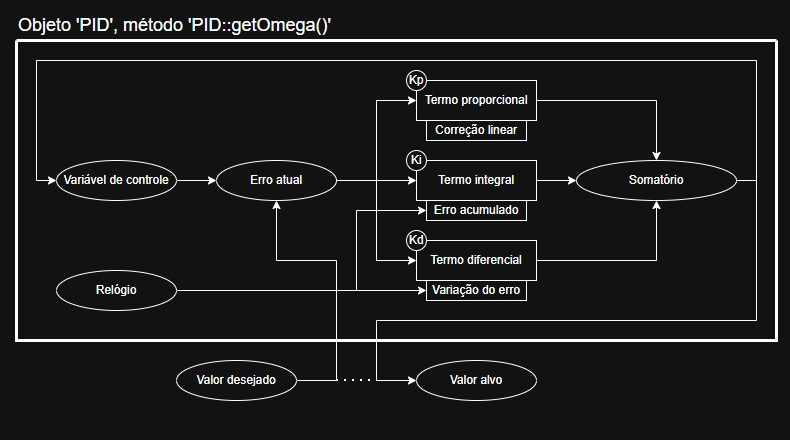

# Controlador PID
O controlador PID servirá para dirigir sinais ao braço de forma a compensar erros externos, como o atrito das juntas.

Cada letra corresponde a um termo utilizado na soma final:
* Proporcional: correção imediata e linear;
* Integral: correção proporcional ao erro acumulado até o instante atual;
* Diferencial: correção proporcional à taxa de variação do erro no instante atual.

O controlador existe como uma função que admite um valor imediatamente desejado, e retorna o valor ajustado para o sistema. Além disso, necessita guardar valores como o erro acumulado para o cálculo do termo integral, e o tempo atual para o cálculo do termo diferencial.

Por isso, faz sentido implementar como um objeto 'PID'. PID:get(valor) retornaria o valor corrigido, e o objeto teria membros correspondentes ao erro acumulado e tempo atual.

